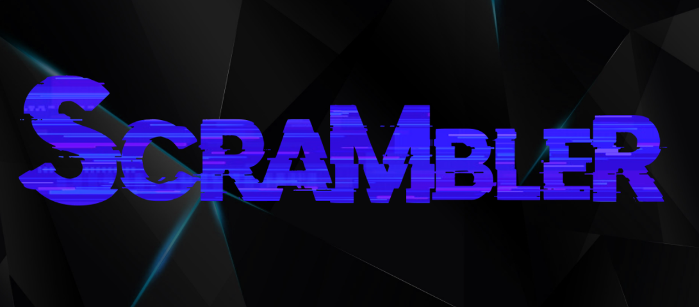
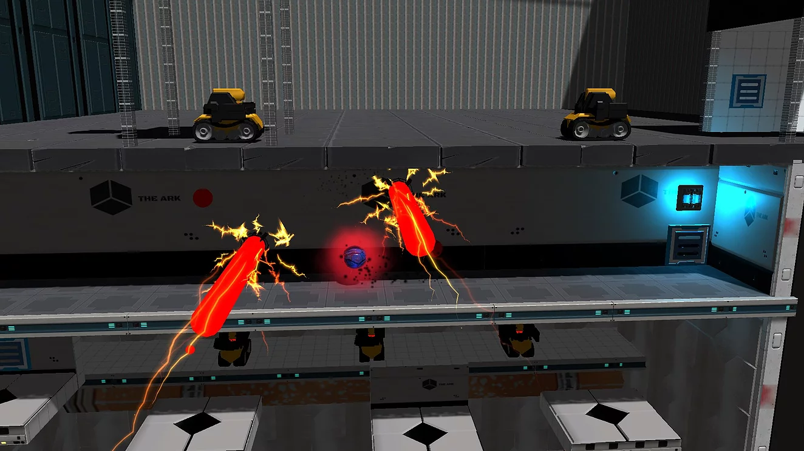
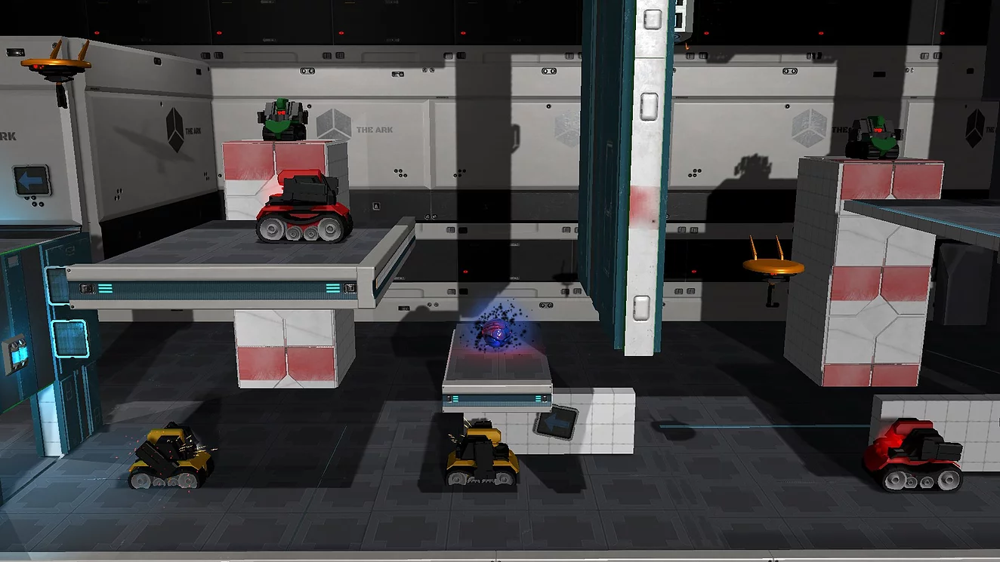
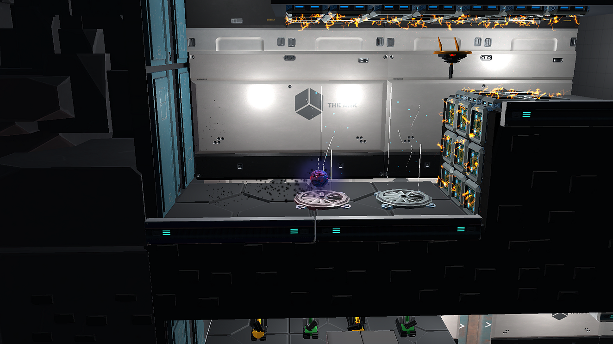

# Toopie

-----

> Programmers :
> Antony GAVELLE
> Hugo CHEMOUNY
> Ryan SANDRIN
> Designers :
> Dan PHILLIPE
> Martin DOUET
> Jeremy MORETON
> Ivan FRIBOURG
> Aurelien ROUSSE

## Description :

Development of a 2.5D Plateformer on Unity with a team of 8 (3 Game Programmer and 5 Game Designer).
I develop many parts of the enemies, some level design blocks and the core mechanic, taking control of AI.
You play as a virus that can take possession of your enemies and some elements of the scene, your goal is to escape the lab.

